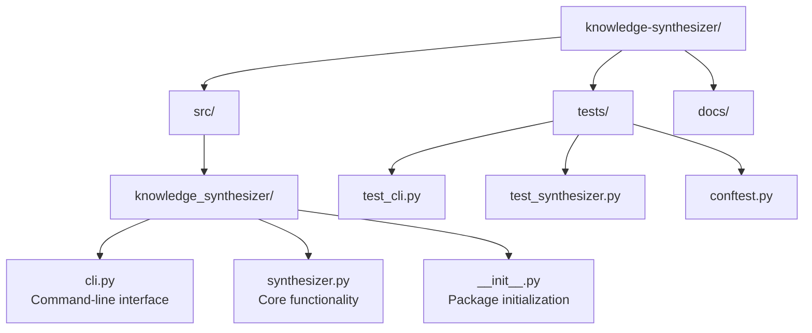
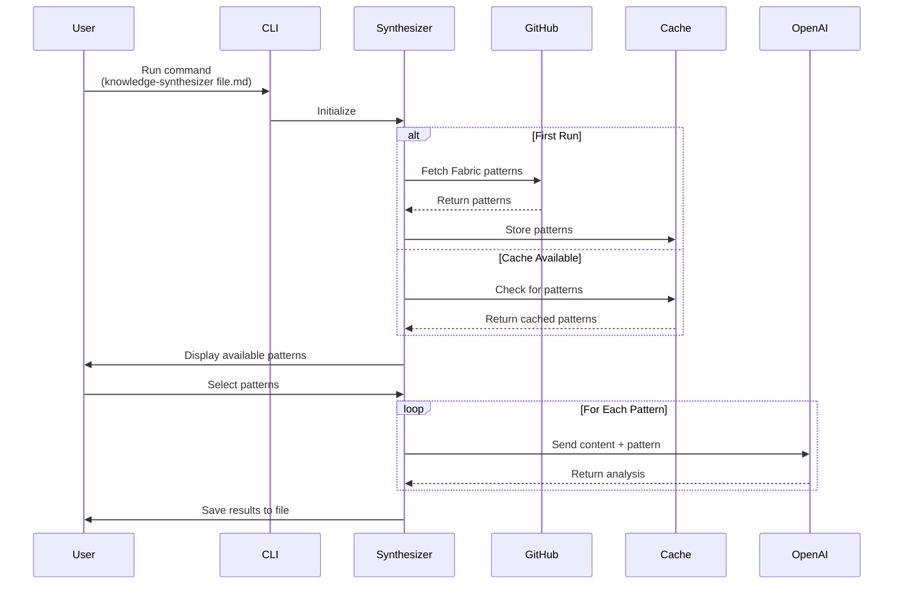
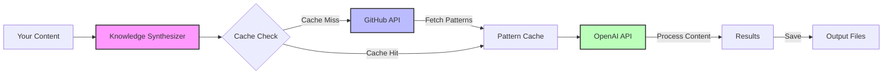
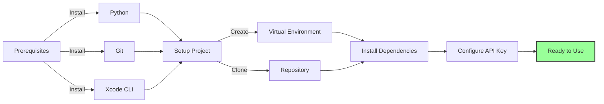

# Knowledge Synthesizer

[](https://github.com/edu-ap/knowledge-synthesizer/actions/workflows/ci.yml)
[](https://codecov.io/gh/edu-ap/knowledge-synthesizer)
[](https://www.python.org/downloads/)
[](https://opensource.org/licenses/MIT)
[](https://github.com/psf/black)
[](https://github.com/PyCQA/bandit)
[](https://mypy-lang.org/)

A Python tool that integrates with Daniel Miessler's groundbreaking [Fabric](https://github.com/danielmiessler/fabric) project, allowing you to apply its powerful AI patterns to your local content.

## About Fabric

Fabric, created by Daniel Miessler, is a revolutionary framework that provides a collection of carefully crafted prompts (patterns) for extracting deep insights from content using AI. These patterns represent years of expertise in prompt engineering and knowledge synthesis, making them invaluable for anyone working with AI.

This tool builds upon Fabric's foundation by:

1. Directly accessing Fabric's latest patterns from GitHub
2. Making them easily applicable to local content through Python
3. Preserving the original patterns while adding automation capabilities

## Why Python Integration?

While Fabric's patterns are powerful on their own, this Python integration offers several advantages:

- **Batch Processing**: Apply patterns to multiple files automatically
- **Local Content**: Process your documents without copying/pasting into chat interfaces
- **Customization**: Easily modify output formats and processing workflows
- **Version Control**: Track changes to synthesized content over time
- **Automation**: Integrate with existing tools and workflows
- **Cost Control**: Monitor and manage [API usage](https://platform.openai.com/usage) efficiently

## Features

- Direct integration with [Fabric's pattern repository](https://github.com/danielmiessler/fabric)
- Support for multiple [OpenAI models](https://platform.openai.com/docs/models) (GPT-4, GPT-4 Turbo, GPT-3.5)
- Interactive pattern selection from Fabric's collection
- Configurable input/output formats
- [Rate limiting](https://platform.openai.com/docs/guides/rate-limits) and error handling
- Automated [GitHub-based](https://docs.github.com/en/rest) pattern updates

## Architecture

### Project Structure

The codebase is organized into the following structure:



### Data Flow

This diagram shows how data flows through the system:



### API Integration

How the tool interacts with external services:



### Environment Setup

Steps to get started:



## Installation

### Prerequisites for macOS Users

If you're new to coding on macOS, follow these steps first:

1. **Install Command Line Tools**:
   - Open Terminal (press `Cmd + Space`, type "Terminal", press Enter)
   - Run this command: `xcode-select --install`
   - Click "Install" when prompted
   - Wait for the installation to complete

2. **Install [Python](https://www.python.org/downloads/)**:
   - Visit [Python's website](https://www.python.org/downloads/)
   - Download the latest Python installer for macOS
   - Open the downloaded `.pkg` file and follow the installer
   - Verify installation by opening Terminal and running: `python3 --version`

3. **Install [Git](https://git-scm.com/)**:
   - If not installed, visit [Git's website](https://git-scm.com/download/mac)
   - Download and install Git for macOS
   - Verify installation: `git --version`

### Installation Steps

Open Terminal and run these commands (you can copy/paste them):

```bash
# Clone the repository
git clone https://github.com/edu-ap/knowledge-synthesizer.git

# Navigate to the project directory
cd knowledge-synthesizer

# Create a virtual environment
python3 -m venv .venv

# Activate the virtual environment
source .venv/bin/activate

# Your prompt should now start with (.venv)
# Install dependencies and the package
pip install -r requirements.txt
pip install -e .
```

### Setting Up Your API Key

1. Get an OpenAI API key:
   - Visit [OpenAI's website](https://platform.openai.com/)
   - Sign up or log in
   - Go to API settings
   - Create a new API key

2. Set up your key (choose one method):

   **Option 1 - Using a .env file (recommended for beginners):**
   ```bash
   # Create .env file and open it in TextEdit
   touch .env
   open -a TextEdit .env
   ```
   - In TextEdit, add this line (replace with your actual key):
   ```
   OPENAI_API_KEY=your-key-here
   ```
   - Save and close TextEdit

   **Option 2 - Using Terminal:**
   ```bash
   # Export as environment variable
   export OPENAI_API_KEY=your-key-here
   ```

### Verifying Installation

Run this command to verify everything is working:
```bash
knowledge-synthesizer --version
```

You should see the version number displayed.

## Usage

After installation, you can run the Knowledge Synthesizer using these commands:

```bash
# Basic usage - process a markdown file
knowledge-synthesizer your-file.md

# Process all markdown files in a folder
knowledge-synthesizer your-folder

# See what would happen without making changes
knowledge-synthesizer your-file.md --dry-run
```

### Common Commands Explained

```bash
# Process a single markdown file
knowledge-synthesizer document.md

# Process all markdown files in a directory
knowledge-synthesizer docs/

# Process files recursively (including subfolders)
knowledge-synthesizer docs/ -r --pattern "*.txt"

# Preview without making changes (safe to try!)
knowledge-synthesizer docs/ --dry-run

# Save each pattern's output separately
knowledge-synthesizer docs/ --separate

# Force regeneration of existing outputs
knowledge-synthesizer docs/ --force

# Use a custom output directory and suffix
knowledge-synthesizer docs/ --output "analysis" --suffix "_insights"
```

### Troubleshooting Common Issues

1. **Command not found**:
   ```bash
   # Make sure you're in the virtual environment
   source .venv/bin/activate
   ```

2. **Permission denied**:
   ```bash
   # Make sure you can execute the script
   chmod +x run_tests.sh
   ```

3. **API key not working**:
   - Check if your .env file is in the correct directory
   - Make sure there are no spaces around the = sign
   - Try printing the key: `echo $OPENAI_API_KEY`

## Configuration

1. Set your OpenAI API key:
   - Export as environment variable: `export OPENAI_API_KEY=your-key`
   - Or create a `.env` file with: `OPENAI_API_KEY=your-key`

2. The tool will prompt you to:
   - Select an OpenAI model
   - Choose which Fabric patterns to apply
   - Confirm processing options

## Pattern Caching

To optimize performance and reduce GitHub API calls, the tool caches Fabric patterns locally:

- Patterns are cached in `~/.knowledge_synthesizer/cache/`
- Cache expires after 24 hours
- Use `--skip-cache` to force downloading fresh patterns
- Cache is automatically created and managed

## Output Formats

The tool supports two output formats:

1. **Combined Output** (default):
   - All pattern results are saved in a single markdown file
   - Each pattern's output is preceded by a level-1 heading
   - Files are named: `{input_file}{suffix}.md`

2. **Separate Files** (with `--separate`):
   - Each pattern's output is saved in its own file
   - Files are named: `{input_file}_{pattern_name}.md`
   - Includes source file reference in each output

## Examples

```bash
# Process a single markdown file
knowledge-synthesizer document.md

# Process all markdown files in a directory
knowledge-synthesizer docs/

# Process files recursively with a specific pattern
knowledge-synthesizer docs/ -r --pattern "*.txt"

# Preview what would be processed without making changes
knowledge-synthesizer docs/ --dry-run

# Save each pattern's output separately
knowledge-synthesizer docs/ --separate

# Force regeneration of all outputs
knowledge-synthesizer docs/ --force

# Custom output directory and suffix
knowledge-synthesizer docs/ --output "analysis" --suffix "_insights"
```

## Development

For development setup and contribution guidelines, please see [CONTRIBUTING.md](CONTRIBUTING.md).

### Making Code Changes

After making changes to the Python code, you need to reinstall the package for the changes to take effect:

```bash
pip install -e .  # Don't forget the dot (.) at the end!
```

The `-e .` means:
- `-e`: Install in ["editable" or "development" mode](https://pip.pypa.io/en/stable/cli/pip_install/#editable-installs)
- `.`: Install from the current directory

This reinstallation is necessary when you:
- Make changes to Python code files (`.py` files)
- Add new Python files
- Change package dependencies in `pyproject.toml`
- Modify package structure

You don't need to reinstall when you:
- Change content files (like `.md` files)
- Change configuration files (like `.env`)
- Change documentation

The editable mode creates a special link to your source code instead of copying it, making it easier to test changes during development.

### Running Tests

The project uses [pytest](https://docs.pytest.org/) for testing. Here's how to run tests on macOS:

```bash
# First, make sure you're in the project directory
cd path/to/knowledge-synthesizer

# Activate the virtual environment if not active
source .venv/bin/activate

# Run all tests with the test runner script
./run_tests.sh

# If you get a permission error, make it executable:
chmod +x run_tests.sh
./run_tests.sh

# Or run tests directly with pytest
pytest

# Run tests with coverage report
pytest --cov=src/knowledge_synthesizer --cov-report=html

# View the coverage report in your browser
open htmlcov/index.html
```

### Directory Structure

When running the Knowledge Synthesizer, several directories will be created:

1. **Output Directories** (in your current folder):
   - `synthesis/`: Where your processed files go
   - Example: If you process `document.md`, you'll get `synthesis/document_synthesis.md`

2. **Cache Directory** (in your home folder):
   - `~/.knowledge_synthesizer/cache/`: Stores downloaded patterns
   - To find it: `open ~/.knowledge_synthesizer`
   - Cache files expire after 24 hours
   - Safe to delete if you need space

3. **Development Directories** (hidden, in project folder):
   - `.pytest_cache/`: [Test cache](https://docs.pytest.org/en/stable/cache.html)
   - `htmlcov/`: [Test coverage reports](https://coverage.readthedocs.io/)
   - `.venv/`: [Python virtual environment](https://docs.python.org/3/library/venv.html)
   - `__pycache__/`: [Python cache](https://docs.python.org/3/tutorial/modules.html#compiled-python-files)
   - `*.egg-info/`: [Package metadata](https://setuptools.pypa.io/en/latest/userguide/development_mode.html)
   - All these are managed automatically and safe to delete

To see hidden folders in Finder:
- Press `Cmd + Shift + .` in Finder
- Or use Terminal: `ls -la`

## Credits

This tool would not be possible without Daniel Miessler's Fabric project. All patterns used in this tool are sourced directly from the [Fabric repository](https://github.com/danielmiessler/fabric) and are subject to its license terms. We encourage users to:

1. Star and support the original [Fabric project](https://github.com/danielmiessler/fabric)
2. Follow Daniel Miessler's work on [Twitter/X](https://twitter.com/DanielMiessler)
3. Consider contributing to Fabric's pattern collection

## License

This project is licensed under the MIT License - see the [LICENSE](LICENSE) file for details. 